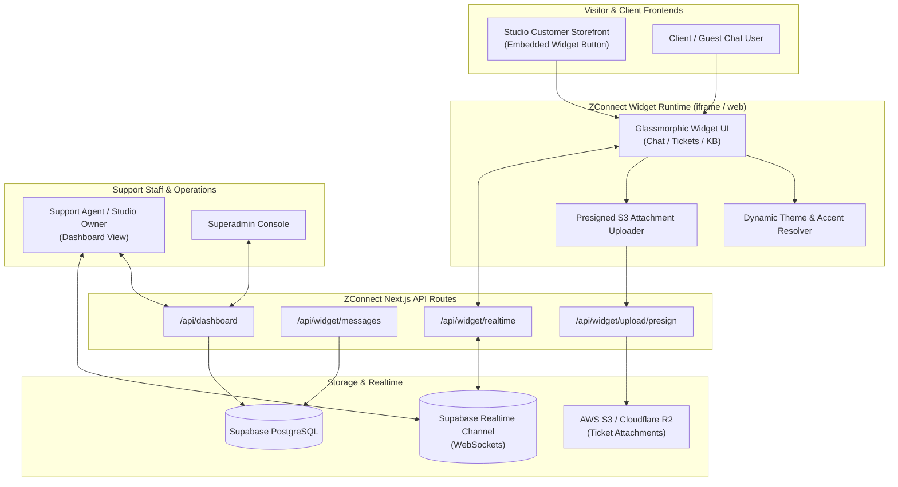

# ZConnect — Embeddable Real-Time Support Widget & Helpdesk Platform

> **Omnichannel Customer Support Widget, Real-Time Live Chat, Ticketing Engine & Superadmin Workspace**  
> Enables instant client messaging, media attachments, automated triage, and ticket management for the Zorvik Tech ecosystem.

[](VERSION.md)
[](https://connect.zorviktech.com)
[](https://nextjs.org/)
[](https://supabase.com/)
[](https://aws.amazon.com/s3/)
[](https://www.framer.com/motion/)
[](LICENSE)

---

## 🌐 Production Endpoints

- **Canonical Helpdesk Platform**: [https://connect.zorviktech.com](https://connect.zorviktech.com)
- **Embeddable Widget Gateway**: `https://connect.zorviktech.com/widget`
- **Agent Command Center**: `https://connect.zorviktech.com/dashboard`
- **Superadmin Portal**: `https://connect.zorviktech.com/superadmin`

---

## 🌟 Executive Overview

**ZConnect** is an enterprise customer engagement and live support platform built on Next.js and Supabase Realtime. It provides high-end creative studios and enterprise SaaS platforms with a lightweight, embeddable chat widget that connects visitors directly to studio agents. Featuring pre-signed multi-cloud file uploads, dynamic ticketing queues, and real-time synchronization, ZConnect bridges communication gaps with zero lag.

### Key Capabilities
- **Embeddable 1-Line Widget**: Easily embedded into any web property via a tiny script tag or secure iframe with full cross-origin postMessage communication.
- **Bi-Directional Real-Time Messaging**: Powered by Supabase Realtime WebSocket channels with instant message delivery and optimistic UI updates.
- **Direct-to-S3 Presigned Media Attachments**: Clients can attach screenshots, PDFs, and screen recordings up to 50MB directly to AWS S3 without overloading serverless functions.
- **Agent Triage Dashboard**: Comprehensive ticket management interface with status filters (`open`, `in_progress`, `resolved`), priority toggles, and internal notes.
- **Glassmorphism 2.0 Theme Engine**: Fully customizable widget aesthetics matching client brand colors, dark/light modes, and typography.

---

## 🏛️ System Architecture & Chat Workflow



---

## 🚀 Core Features

### 1. 💬 Embeddable Floating Chat Widget (`/widget`)
- Compact, floating launcher button with unread message badges.
- Smooth slide-up drawer with tabs for **Live Chat**, **My Tickets**, and **Knowledge Base**.
- Customizable welcome greetings, operating hours indicators, and auto-responder messages.

### 2. 📎 Direct Pre-Signed Cloud Attachments
- Resolves pre-signed PUT URLs via `/api/widget/upload/presign`.
- Supports image previews (PNG, JPG, WebP), documents (PDF), and video clips with strict MIME-type sanitization.

### 3. 🎯 Centralized Agent Dashboard (`/dashboard`)
- Real-time incoming conversation queue with audible chime notifications.
- Ticket categorization (Billing, Proofing, Technical, Inquiry).
- One-click status transitions and resolution archiving.

### 4. 📚 Self-Service Knowledge Base (`/docs`)
- Searchable directory of studio policies, turnaround timelines, and package FAQ articles.
- Deflects routine support inquiries before tickets are opened.

---

## 📁 Repository Directory Structure

```
ZConnect/
├── public/                  # Favicons, widget embed script, static icons
├── src/
│   ├── app/                 # Next.js App Router
│   │   ├── api/             # API routes
│   │   │   ├── auth/        # Agent login and session validation
│   │   │   ├── dashboard/   # Support queue and ticket metrics
│   │   │   └── widget/      # Realtime chat, messages, S3 presign
│   │   ├── dashboard/       # Agent ticket triage command center
│   │   ├── docs/            # Knowledge base and API integration guide
│   │   ├── login/           # Agent authentication portal
│   │   ├── superadmin/      # Global multi-tenant configuration
│   │   ├── widget/          # Standalone widget page for iframe embedding
│   │   ├── layout.tsx       # Root layout
│   │   └── page.tsx         # Interactive demo and product landing page
│   ├── components/          # Reusable UI components
│   │   ├── ui/              # Glassmorphic buttons, badges, modals
│   │   └── ZConnectLogo.tsx # Official vector branding
│   ├── lib/                 # Supabase client, S3 signer, utility functions
│   └── types/               # TypeScript interfaces (SimTicket, SimMessage)
├── .env.example             # Documented environment blueprint
├── eslint.config.mjs        # Strict ESLint configuration
├── next.config.ts           # Next.js build and image settings
├── package.json             # Scripts and dependencies
└── VERSION.md               # Version changelog
```

---

## ⚙️ Environment Configuration (`.env`)

Create `.env.local` based on `.env.example`:

| Variable | Required | Description | Example / Target |
| :--- | :--- | :--- | :--- |
| `NEXT_PUBLIC_SITE_URL` | Yes | Canonical application URL | `https://connect.zorviktech.com` |
| `NEXT_PUBLIC_SUPABASE_URL` | Yes | Supabase PostgreSQL project URL | `https://your-project.supabase.co` |
| `NEXT_PUBLIC_SUPABASE_ANON_KEY` | Yes | Supabase public anon key | `eyJhbGci...` |
| `SUPABASE_SERVICE_ROLE_KEY` | Yes | Elevated Supabase service key | `eyJhbGci...` |
| `AWS_S3_BUCKET` | Yes | Dedicated S3 attachment bucket | `zorvik-connect-attachments` |
| `AWS_ACCESS_KEY_ID` | Yes | AWS S3 access key ID | `AKIA...` |
| `AWS_SECRET_ACCESS_KEY` | Yes | AWS S3 secret access key | `wJalr...` |
| `AWS_REGION` | Yes | AWS S3 bucket region | `ap-south-1` |

---

## 🛠️ Local Development & Quality Runbook

### 1. Install Dependencies
```bash
npm install
```

### 2. Start Development Server
```bash
npm run dev
```
Accessible at `http://localhost:3000` (or `3001`).

### 3. Run Strict Linting (Zero-Warning Policy)
```bash
npm run lint
```

### 4. Production Build & Start
```bash
npm run build
npm run start
```

---

## 👨‍💻 Founder & Architectural Leadership

**ZConnect** is designed, architected, and maintained by:

- **Founder & Lead Architect**: **Vikash Kumar Singh**
- **Email**: [vikash@zorviktech.com](mailto:vikash@zorviktech.com)
- **Phone / WhatsApp**: [+91 8409792083](tel:+918409792083)
- **LinkedIn**: [linkedin.com/in/itsmevikashkumarsingh](https://www.linkedin.com/in/itsmevikashkumarsingh/)
- **GitHub**: [@ItsMeVikashKumarSingh](https://github.com/ItsMeVikashKumarSingh)
- **Website**: [zorviktech.com](https://zorviktech.com)

---

## 📄 License & Intellectual Property

**Copyright © 2026 Zorvik Tech. All Rights Reserved.**

This software and its associated source code, design systems, algorithms, and documentation are the proprietary intellectual property of **Zorvik Tech**. Unauthorized copying, reproduction, distribution, reverse engineering, or commercial use is strictly prohibited without prior written consent.
